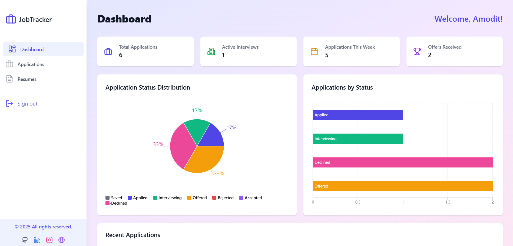

# Job Tracker - Your Personal Job Application Organizer 🚀

A comprehensive web application to manage your job search process, track applications, and store resumes efficiently.

 <!-- Add actual screenshot path later -->

## ✨ Features

- 📊 Dashboard with application statistics
- 📝 Track jobs with multiple status stages (Applied, Interviewing, Offer, Rejected)
- 📁 Resume management with cloud storage
- 🔍 Search jobs by company or position
- 📅 Application deadline tracking
- 🔐 User authentication
- 📱 Responsive design

## 🛠️ Technologies Used

**Frontend:**
- React.js
- TypeScript
- Tailwind CSS
- React Query
- React Hook Form
- Lucide React Icons

**Backend:**
- Supabase (Authentication, Storage, Database)
- PostgreSQL

**Hosting:**
- Vercel/Netlify

## 🚀 Getting Started

### Prerequisites
- Node.js (v18+)
- npm (v9+)
- Supabase account

### Installation

1. **Clone the repository**
- git clone https://github.com/yourusername/job-tracker.git
cd job-tracker

2.** Install dependencies**
- npm install

3. **Set up environment variables**
Create .env file in root directory:
- VITE_SUPABASE_URL=your-supabase-url
- VITE_SUPABASE_ANON_KEY=your-supabase-anon-key

4.**Run the development server**
- npm run dev

🖥️ Usage
1.**Sign Up/Login**

- Create an account or login using email/password

2.**Add Job Application**

- Click "+ Add Job" button

- Fill in company details and position

- Upload resume (PDF/DOCX)

3.**Track Progress**

- Update application status through drag-and-drop

- Add interview notes and deadlines

4.**Manage Resumes**

- Upload multiple resume versions

- Search and filter resumes by title

- Download/Delete resumes

5.**Search Jobs**

-Use the search bar to find specific applications
